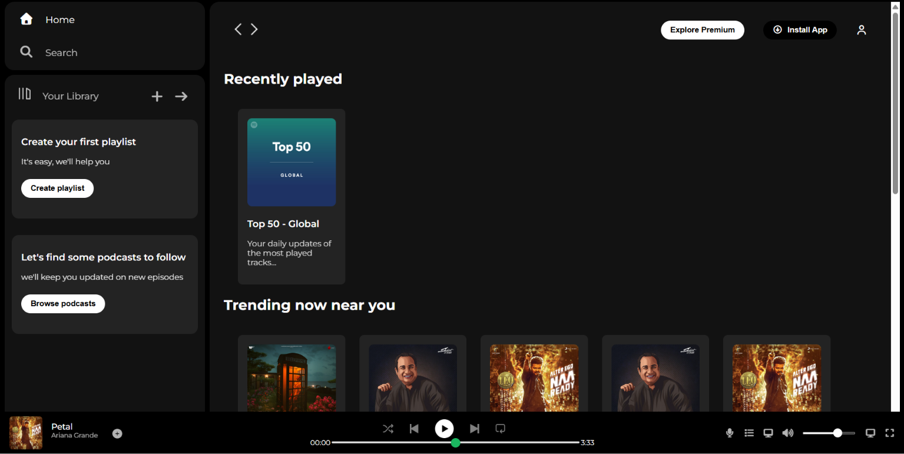

# 🎵 Spotify Clone

A Spotify-inspired music player user interface built using HTML and CSS.



## 📌 About the Project

This project is a frontend recreation of the Spotify web player interface.  
It was built to practice HTML structure, CSS styling, layout design, and Flexbox.

## 🛠️ Technologies Used

- HTML5
- CSS3
- Flexbox

## ✨ Features

- Spotify-inspired user interface
- Sidebar navigation
- Music library section
- Main music content area
- Music player section at the bottom
- Album and playlist layouts
- Custom styling using CSS

## 📂 Project Structure

```text
spotify-clone/
│
├── Assets/
│   ├── images
│   └── other assets
│
├── index.html
├── style.css
└── README.md
